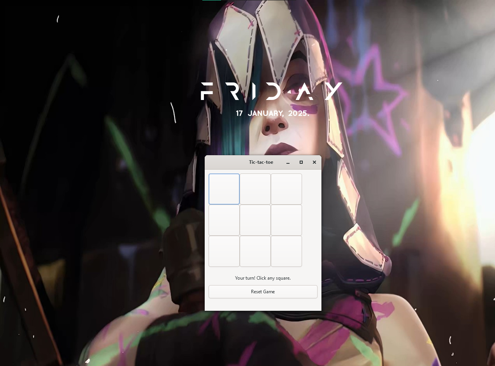

# Tic-Tac-Toe with AI (GTK GUI)

A GUI-based Tic-Tac-Toe game written in C using the GTK library. This project features a player-vs-computer mode where the computer utilizes the Minimax algorithm to make optimal moves.

## Features

- **Player vs Computer Gameplay**: Play against a smart AI opponent.
- **Minimax Algorithm**: The AI uses a decision-making algorithm for optimal moves.
- **Responsive GUI**: Built using GTK for a user-friendly interface.
- **Reset Functionality**: Reset the game anytime to start fresh.
- **Draw Detection**: Handles scenarios where the game ends in a draw.

## Screenshots



## Installation

### Prerequisites

- A C compiler (e.g., `gcc`)
- GTK 4 development libraries. Install using:
  ```bash
  sudo apt install libgtk-4-dev
  ```

### Clone the Repository

    ```bash
    git clone https://github.com/YngJesus/TicTacToe-GUI.git
    cd TicTacToe-GUI
    ```

### Compile the Code

    ```bash
        gcc tictactoe.c -o tictactoe `pkg-config --cflags --libs gtk4`
    ```

### Run the Game

    ```bash
    ./tictactoe
    ```
